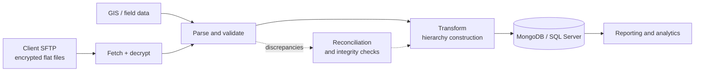

<h1 align="center">Charles Carter</h1>

  <b>Data Engineer</b> &nbsp;·&nbsp; ETL, Schema Design &amp; Pipeline Automation &nbsp;·&nbsp; B.S. Mathematics

  

  
  
  
  

---

### About

Data engineer with **5 years building production data systems**. I've architected document schemas and importers governing **4M+ survey records**, automated encrypted SFTP ingestion into MongoDB, and cut time complexity **30%** on core systems.

Currently at **Alden Systems**, turning raw field and GIS data into clean, structured asset datasets for pole owners and power utilities.

A mathematics background sits behind all of it: precise about correctness, comfortable reasoning through algorithms and data structures, and used to writing the specification before the code.

---

### By the numbers

<table align="center">
  <tr>
    <td align="center" width="25%"><h3>4M+</h3>survey records schema-designed</td>
    <td align="center" width="25%"><h3>166K+</h3>employee records ingested &amp; structured</td>
    <td align="center" width="25%"><h3>&minus;30%</h3>time complexity on core systems</td>
    <td align="center" width="25%"><h3>&minus;23%</h3>system load time</td>
  </tr>
</table>

---

### Toolkit

  
  
  
  
  
  
  
   
  
  
  
  
   
  
  
  
  
  

<b>The full stack, by discipline</b>

 

| Area | What I work with |
| --- | --- |
| **Languages** | Python, SQL / T-SQL, JavaScript, TypeScript, HTML, CSS, Bash |
| **Databases** | MongoDB, SQL Server, PostgreSQL, MySQL — document schema design, data modeling, indexing and query tuning |
| **Pipelines & ETL** | Ingestion automation, SFTP fetch / decrypt / parse, flat-file and API parsing, transformation pipelines, hierarchy construction, batch scheduling, data reconciliation |
| **Cloud & tooling** | Cloud-based data services, REST APIs, Git, Postman, Jira, UAT and release validation, technical specification writing |
| **Data & geospatial** | GIS and field data processing, large-scale dataset synthesis, data quality and integrity analysis, reporting and analytics enablement |
| **CS foundations** | Data structures & algorithms, complexity analysis and optimization, performance profiling, proof-based mathematical reasoning |

---

### How a pipeline usually looks on my desk

---

### Experience

**Product Specialist / Data Engineer** — *Alden Systems, Birmingham, AL* · Dec 2025 – Present

- Engineer and synthesize large-scale asset datasets from multiple sources, turning raw field and GIS data into clean, structured outputs.
- Translate complex data requirements from pole owners and power utilities into actionable engineering workflows, keeping deliverables accurate and on time.
- Own continuous-improvement work across AldenOne transformation pipelines end to end, through UAT signoff.
- Drive cross-functional work across product, engineering, and client success to find data gaps, resolve discrepancies, and improve the integrity of utility asset management systems.

**Senior Technical Analyst** — *Medallia, Birmingham, AL* · Jul 2023 – Nov 2025

- Architected document schemas and data importers for **4M+ survey records**, defining how data was parsed, structured, stored, and accessed by downstream analytics.
- Designed automated SFTP ingestion workflows to fetch, decrypt, and parse flat files from enterprise sources directly into MongoDB collections.
- Mentored junior analysts on architecture decisions and implementation best practices, raising the team's delivery capability.

**Technical Analyst** — *Medallia, Birmingham, AL* · Jul 2021 – Jul 2023

- Orchestrated upstream data ingestion from client SFTP feeds, processing **166K+ employee records** to construct organizational hierarchy structures for client-facing reporting systems.
- Administered and optimized data structures and algorithms, reducing time complexity **30%** for core systems, and cut system load time **23%** using efficient cloud-based technologies.
- Built data transformation pipelines integrating hierarchy and account data into reporting systems, enabling scoped employee feedback analysis and action planning.

**B.S. Mathematics** — *Birmingham-Southern College* · Aug 2017 – May 2021

---

### GitHub

  
  

---

### Availability

Available for **contract, part-time, and fully remote** work — flexible and asynchronous alongside full-time employment, comfortable with project-based engagements and detailed written guidelines.

  <a href="mailto:charlescarter12012@gmail.com"><b>charlescarter12012@gmail.com</b></a>
  &nbsp;·&nbsp;
  <a href="https://linkedin.com/in/charles-carter-5b950430a"><b>LinkedIn</b></a>

